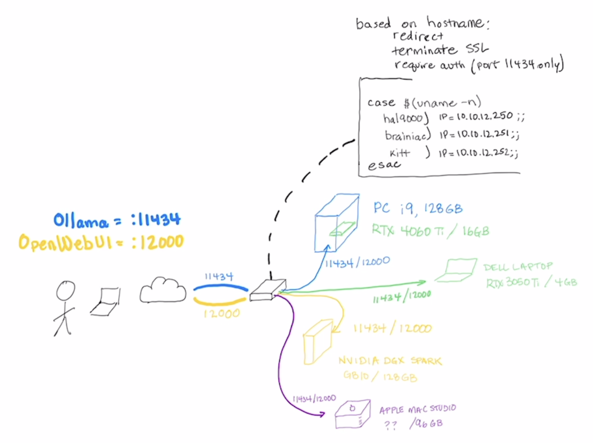

# README

# Purpose (What)
Documentation for an approach to adding a proxy to frontend AI resources hosted locally in a DMZ to be accessed from other internal networks or the Internet.

Status: This was just started - expect updates with more explanation and details.

# Why

I have VPN access to my enviromemnt, but I was hoping to create a way that I can still utilize command-line/programmatic access to my resources, using the same method whether I am home or away (<<< this proved rather challenging).

Requirements (loose):

* provide proxy for different hosts (hostname-based redirect)
* add authentication for Ollama
* terminate SSL (seemed like I might as well)

# How
I have a border gateway/firewall which I DNAT the standard ports to my HAproxy node (11434/12000 - Ollama/OpenWebUI).  From there I direct the ingress traffic to the appropriate node based on hostname (jarivs - PC with RTX card, spark-E - NVIDIA DGX Spark).

My devices will have 2 hostnames each:
* jarvis - connect directly to the device using the primary interface (internal only)
* jarvis-api - connect through the proxy (internal), or the public IP which redirects to the proxy)

# Todo

Add FAIL2BAN to monitor for multiple failed login attempts.

